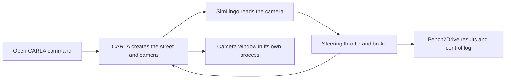

# adapters/simlingo

The Mac bring-up runs the stock Windows CARLA 0.9.15 server through
Sikarugir/D3DMetal and uses a compiled arm64 Python client. Savio runs the stock
Linux server on the GPU node. Both launchers share `route_run.py` (evaluator,
environment, readiness checks) and `artifacts.py` (pinned checksums), and use the
same `.runtime/` and `checkpoints/` layout. Neither covers the Fail2Drive custom
server.

## Run on Savio

From a clone of this repository under `/global/scratch/users/$USER`, on a login
node. Setup is idempotent and checksum-verified; rerun it after an interruption.

```bash
curl -LsSf https://astral.sh/uv/install.sh | sh
uv run --no-project --python 3.10 --with pyyaml adapters/simlingo/setup_savio.py
bash scripts/submit.sh gpu scripts/check_gpu.sbatch
bash scripts/submit.sh gpu scripts/step1.sbatch
```

Setup clones the pinned SimLingo revision and applies both source patches,
downloads the checkpoint and InternVL2-1B at pinned revisions, downloads and
unpacks the Linux CARLA tarball and additional maps (about 16 GB, checked against
`configs/setup/simlingo-artifacts.yaml`), and builds `.runtime/policy-venv` from
`requirements-linux.lock` (Python 3.10, because carla 0.9.15 has no Linux wheel
for 3.11). A fresh clone plus the two patches matches the Mac source tree byte for
byte.

`step1.sbatch` runs `run_savio.py render` (100 synchronous frames, non-black
camera, vehicle moves), `verify_checkpoint.py`, then `run_savio.py route` on
route 26956, the route the Mac run completed. Evidence lands in
`results/savio/<job>/`; `route/readiness.json` carries wall-clock, real-time
factor and whole-stack peak VRAM sampled from `nvidia-smi`. CARLA takes a free
port block per job, because GPU nodes are shared. If `render` fails on host
Vulkan, set `carla.container` in `configs/cluster/savio.yaml`.

## Open the simulation

Double-click `../../Open CARLA.command`, or run from the repository root:

```bash
.runtime/policy-venv/bin/python adapters/simlingo/run_local.py
```

The command starts a fresh server, opens the policy's actual RGB camera in a
native window with its own event loop, runs route 26956 with SimLingo, saves Bench2Drive results and
controls under `results/local-mac/<timestamp>/`, then stops the server. Keep the
Mac lid open and the screen unlocked to inspect the window. The launcher
prevents ordinary idle sleep for the duration of the run; plugging into power is
recommended. Space freezes the displayed image without
changing the experiment; Escape stops the run. An occupied port 2000 is rejected.

`configs/rollout/local-mac.yaml` pins Town05, SignalizedJunctionRightTurn, seed 0,
commentary off, MPS inference with CPU operator fallback, and Epic rendering.
Low rendering crashed the Windows server during sensor startup on this Mac.
The native client reports `0.9.15-macclient`; the server reports `0.9.15`. The
client suffix identifies our build and produces a version-string warning.



`readiness.json` is written only after a finished route with model-driven
throttle, no skipped scenario and no agent/server crash. A policy driving failure
is recorded separately from a software failure. Local evidence does not supply
Savio throughput, whole-stack peak VRAM, full 220-route readiness, or Fail2Drive
custom-build compatibility. Official additional maps are installed, and all
12 towns referenced by the benchmark XML are present. All 22,211 packaged files
passed length and CRC checks. Town12 also passed a 100-frame camera/control smoke
test. These checks do not establish successful policy runs across every town.

Verified local result: `results/local-mac/20261002-182756/readiness.json`.
The 73.757 m route completed with 293 actual model inference steps in 244.670 wall
seconds (14.7 simulated seconds, 0.0601× real time). No collisions, traffic-light
or stop violations, deviation or timeout were recorded. Minimum-speed ratios are
logged at every checkpoint by the pinned criterion and have no score penalty.
This run is integration evidence; one route does not reproduce benchmark scores.
The desktop view and Space pause/resume were inspected; Escape was verified to
stop the evaluator and server without issuing readiness for the cancelled run.

The launcher creates `.runtime/CARLA Camera.app` from the installed Python app,
assigns it a separate local app identity and signs the copy locally. The viewer
uses the same virtual environment and reads atomically saved real camera images.
It does not create another sensor or control the vehicle.

## Many routes, and Step 3 capture

```bash
.runtime/policy-venv/bin/python adapters/simlingo/run_local.py --no-view --route 24841
.runtime/policy-venv/bin/python adapters/simlingo/sweep_local.py --until 08:45 --capture-every 10
HF_HUB_OFFLINE=1 .runtime/policy-venv/bin/python adapters/simlingo/replay_capture.py RUN_DIR --device mps
```

`--route` takes the town and scenario from the pinned routes file. `sweep_local.py`
runs one seeded route per scenario type (44 of the 220; the file has exactly five
per type, so the sample is stratified), one fresh server per route, and resumes
when rerun with the same `--output`. It retries a route only when it failed
before the evaluator started, so a driving outcome is never re-rolled, and it caps
each route at 35 wall minutes; a capped route is unscored, not failed. Each
record also carries the longest stationary stretch and how often SimLingo's own
stuck detector forced it forward (40 simulated seconds still, then 15 creep
frames). A route can score 100 only because that heuristic rescued it.

`--capture-every N` swaps in `capture_agent.py`, which hooks all 24 decoder-layer
outputs (PRD §12.1) and logs, every step, both waypoint heads and each layer's
output mean-pooled over all tokens and over the 30 driving queries. Every Nth step
it saves the exact model input. `replay_capture.py` reruns those inputs offline.
The per-step log is flushed every 200 steps and when the route ends, so a route
stopped at the wall cap loses its last partial block (route 2144 kept 2,000 of
2,168 steps).
On 2026-10-06 (route 26956, 29 saved frames, `results/local-step3/`):

| Logged on | Replayed on | Worst waypoint difference | Within 1e-3 m |
|---|---|---|---|
| MPS fp32 | MPS fp32 | 0.0 m | yes |
| MPS fp32 | CPU fp32 | 9.1e-5 m | yes |
| MPS fp32 | MPS float16 | 4.8 cm (1.1 cm mean per frame) | no |
| MPS fp32 | CPU bfloat16, first 4 frames | 18 cm (8.8 cm mean per frame) | no |

Half precision alone moves waypoints by centimetres, and bfloat16, which Savio
runs, by up to 18 cm on these frames. So a replay must use the dtype the run
logged with (`replay_capture.py` rebuilds the model in it), and Mac fp32
rollouts are a measurably different policy from Savio's bfloat16 ones at the
frame level. MPS in this torch build has no bfloat16 and CPU bfloat16 took
about 10 minutes a frame, hence four frames. On Savio, check CUDA bfloat16
replay against itself first.

The replay also confirms that the last 30 positions of the final block, after the
final norm, are exactly what the driving head decodes. Capture cost no measurable
speed (0.0595× against 0.0558–0.0601× without it). This meets Step 3's replay
condition on the Mac only; Savio runs CUDA in bfloat16 and must be checked
there.

## Native client and runtime

Exact revisions, checksums and patch paths are in
`../../configs/setup/simlingo-artifacts.yaml`. The native client build follows
[nfriend's Mac client guide](https://github.com/nfriend/carla/blob/0786f27568f1adfa645232e812b440cc7e3742ed/Docs/build_mac_client.md).
Boost 1.80 needs `patches/boost-python311-enum.patch` for Python 3.11. Apply that
patch to the Boost source with `patch -p1`, rebuild the static Boost.Python
archive, then rebuild the wheel. Both CARLA dependency archives must contain the
fixed `enum.o`.

```bash
uv pip install --python .runtime/policy-venv/bin/python -r adapters/simlingo/requirements-mac.lock
uv pip install --python .runtime/policy-venv/bin/python .runtime/carla-native/PythonAPI/carla/dist/carla-0.9.15-cp311-cp311-macosx_26_0_arm64.whl
git -C .runtime/simlingo apply ../../adapters/simlingo/patches/external-server.patch
.runtime/policy-venv/bin/python adapters/simlingo/verify_carla.py --host localhost
```

The CARLA verifier checks exact synchronous camera/frame matches, actual pixels,
and vehicle movement. Its result is a camera/control smoke test, not SimLingo
route evidence. The launcher checks source patches and checkpoint/client-wheel
checksums before starting. `requirements-mac.lock` excludes the separately built
CARLA wheel. The old Docker client route was unstable and is not used.

## Offline checkpoint verification

The Mac setup has pinned source in `.runtime/simlingo`, the base model in
`.runtime/InternVL2-1B`, and the checksum-verified released weights under
`checkpoints/simlingo/`. Exact revisions live in
`../../configs/setup/simlingo-artifacts.yaml`; the policy environment is separate
from the harness. The same frozen Mac environment supports CPU verification, MPS
inference and the native CARLA client.

```bash
HF_HUB_OFFLINE=1 .runtime/policy-venv/bin/python adapters/simlingo/verify_checkpoint.py
```

The verifier checks the source revision, applied patch and weight checksum,
strict-loads the whole model, then checks finite waypoint outputs from a dummy
camera input. It writes `results/setup/model-smoke.json`; it never marks CARLA
camera rendering or closed-loop driving as verified.

`patches/runtime-compatibility.patch` selects CPU/MPS/CUDA with matching dtypes,
strict-loads the weights, selects evaluation mode, uses the installed base model
for both loading and prompts, and fixes the scalar speed input to the PID
controller. It also selects commentary-off inference and unpacks the feature/logit
tuple correctly in that model branch. The original
branch raises `TypeError: tuple indices must be integers or slices, not tuple`;
the patched branch passes with the same released weights. Apply it after cloning
the manifest's source revision:

```bash
git -C .runtime/simlingo apply ../../adapters/simlingo/patches/runtime-compatibility.patch
```

## Policy facts

Verified from the paper (`docs/step0-trackA-findings.md`):

- InternVL2-1B = InternViT-300M-448px + Qwen2-0.5B-Instruct.
- Learnable query tokens `q_p` (path) and `q_w` (speed); an MLP on their output
  features predicts waypoint *differences*, cumulatively summed. One forward
  pass, not autoregressive.
- LoRA r=32, α=64, dropout 0.1 on all LLM linear layers. **Everything else is
  fully finetuned — the vision encoder is NOT frozen** in SimLingo's own recipe.
  (Our repair step freezes it, which is our deviation; see `PRD.md` §9.4.)
- SmoothL1 waypoint loss.
- Run with commentary/CoT **off** in the main campaign (`PRD.md` §10.1).

Verified by strict checkpoint loading and CPU inference on 2026-10-02:

- Hidden size: 896; language decoder layers: 24.
- Query parameters: `adaptors.driving.query_embeds_wps` (1 × 20 × 896) and
  `adaptors.driving.query_embeds_speed` (1 × 10 × 896).
- Readout heads: `adaptors.driving.route_head` and `adaptors.driving.speed_wps_head`.
- The pinned source includes Bench2Drive 0.0.3.

## Licensing

Code is Apache-2.0. The **dataset is Wayve non-commercial** — do not
redistribute it, and see `PRD.md` §16 for the open question about releasing
derived checkpoints.
